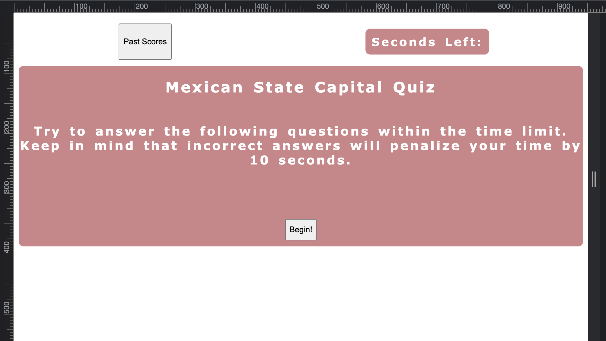
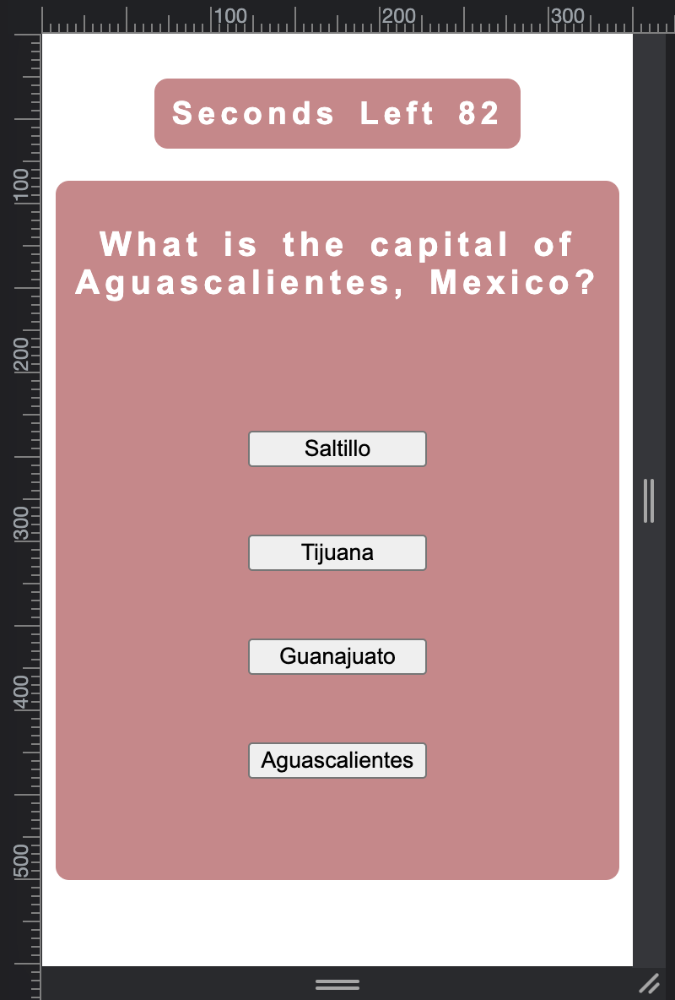
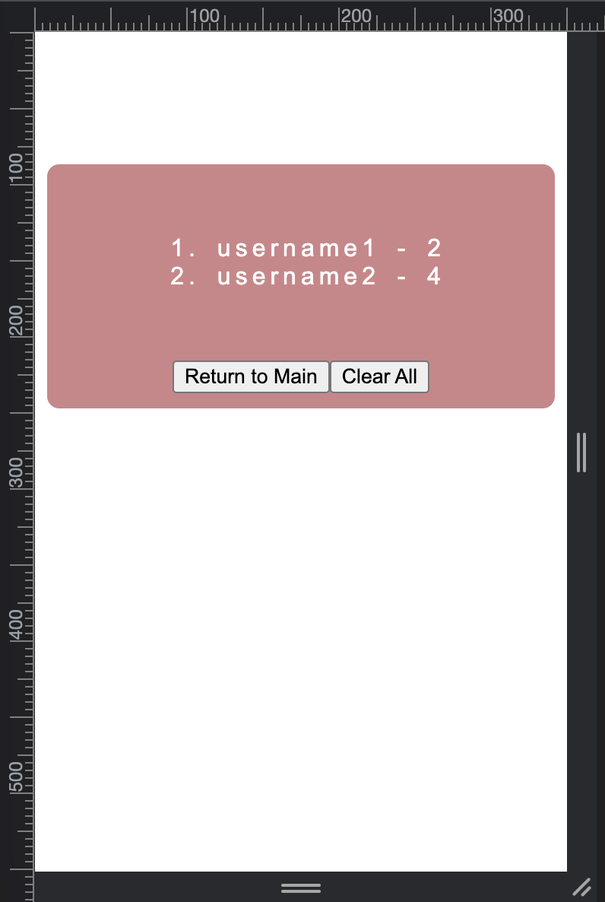

# challenge-4-timed-quiz-w-localStorage

## Description

This application is a timed quiz on Mexican State Capitals that uses JavaScript to: subtract time from the clock if users select the incorrect option, adds points when users select the correct option, and provides the option to save a user’s final score when the game ends or delete the score history. This application runs in the browser and has dynamically updated HTML and CSS through JavaScript as well. I learned about the importance of programming with comments and using DevTools to debug issues with JavaScript and CSS styling.

## Usage
To use this application users can navigate to the application by clicking on the first link this; to visit the application’s repo, click on the second link:

### Link to Application
https://perfectblue0.github.io/challenge-4-timed-quiz-w-localStorage/

### Link to Repo
https://github.com/perfectblue0/challenge-4-timed-quiz-w-localStorage

Once the user is on the page, to the right of the screen will be the time which will start once they click the “Begin!” button. As shared on the page, this application is a timed quiz; whenever users click the wrong choice they will be penalized by 10 seconds. As users click on their choices, the application will evaluate whether they chose correctly and if they did they will see “Bien Hecho” which translates to “Well Done” in Spanish. When users click the wrong choice the next set of questions will load and below they will see “Ni modo” which translates to “Not a Big Deal” in Spanish. After the fifth question or if the time reaches to 0, users will then be able to enter their Name in the form and save their final points by clicking the “Save” button. They will then see their name appear next to their final points. They may choose to clear the score sheet by clicking the “Clear All” button. By clicking “Return to Main” they will navigate back to the initial page. To view saved scores they can click on the “Past Scores” button which will be shown at before they click the “Begin!” button.

## Credits
I used Stackoverflow, W3Schools, and the recordings of before and after class Zoom sessions to complete this assignment.

## License
Please refer to license in the repo.
